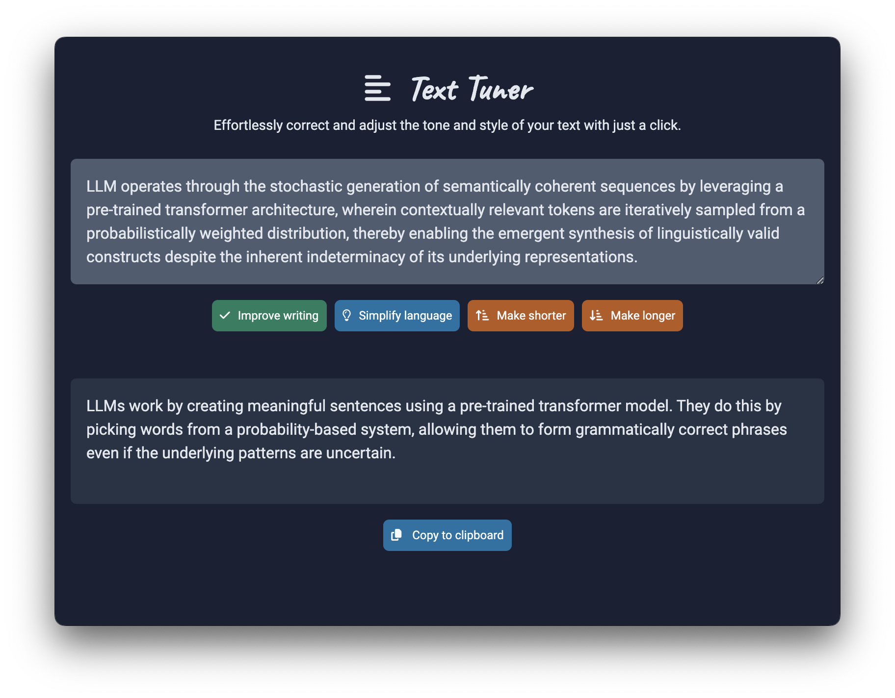

# text-tuner



## How to run the project locally

1. Create a .env File in the root folder and add the following:

```javascript
OPENAI_API_KEY = "your-secret-key";
```

2. Run the following commands:

```bash
npm install
npm run start
```
